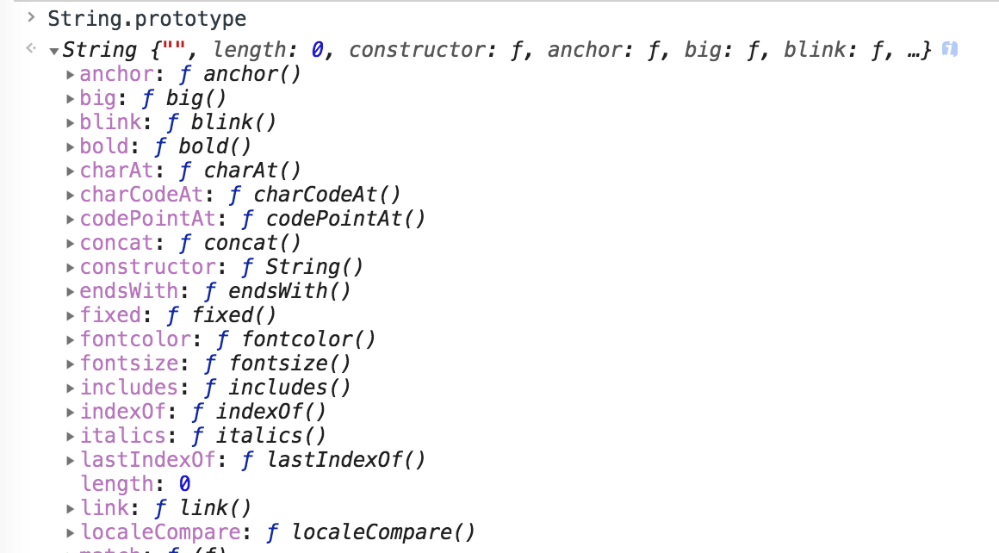

我们先来看一个小的问题
```javascript
const a = 'str'
const b = new String('str')

const c = String('str')

console.log(a === b) // false
console.log(b === c) // false
console.log(a === c) // true
```
在控制台输出的结果为`false`。仔细分析一下：  

- `a`是一个`string`类型的值，是一个基本类型
- `String` 函数是一个转型函数, 所以返回的一个字符串
- 对于`new`操作符来说，`String`是一个构造函数，返回值就是一个对象

自然：`a !== b`是因为他们一个是基本类型的值 一个是对象， 所以不相等； `a === c`因为`'str'`被转成字符串的`'str'`当然还是`'str'`；就类似`Number(1) === 1`一样。

再看另一个问题：

```javascript
const a = 'str'
a.str = 'a'

const b = new String('str')
b.str = 'b'

console.log(a.str) // undefined
console.log(b.str) // 'b'
```

关于`b`比较好理解 因为`b` 是一个对象嘛；  
首先先验证一下`b`:

```javascript
const b = new String('str')

typeof b // object
```

这个没有问题。符合我们的猜测

那有关上述的a的问题 就不得不谈谈javaScript的基本包装类型了

## 基本包装类型
什么是基本包装类型：

引用《JavaScript高级程序设计》内的一段话：

> 为了便于操作基本类型值，ECMAScript 还提供了 3 个特殊的引用类型：Boolean、Number 和 String。

> 每当读取一个基本类型值的时候，后台就会创建一个对应的基本包装类型的对象，从而让我们 能够调用一些方法来操作这些数据。

> 在读取模式中访问字符串时，后台都会自动完成下列处理。  
> (1) 创建 String 类型的一个实例；  
> (2) 在实例上调用指定的方法；  
> (3) 销毁这个实例。

而我们上面的代码：
```javascript
const a = 'str'
a.str = 'a'
```
在给`a`赋值的时候： 
- 首先创建了一个包装类型的实例
- 再给这个实例的`str`属性赋值`a`
- 销毁这个实例

所以在这句赋值操作结束之后，那个具有`str`属性的对象已经被销毁了。

```javascript
console.log(a.str) // undefined
```

这个读取操作也包含了上述的三个步骤，在读取对应初始包装类型对象的`str`属性时，自然获取到的值为`undefined`，那个具备`str`属性的包装对象早就被销毁了！

在分析一下
```javascript
const a = 'hello world'
console.log(a.substr(-5))
```

这个`substr`方法也是来自其对应的包装对象原型上的方法

```javascript
console.log(String.prototype)
```


## 总结
类似的像`String`的包装类型还有`Number`、`Boolean`；他们作为函数单独调用的时候，是转型函数；又可以与`new`操作符配合，作为基本包装类型的构造函数。

实际中我们大多使用基本类型，这里的举例只是为了更好的理解基本类型。
